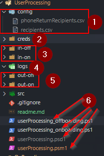
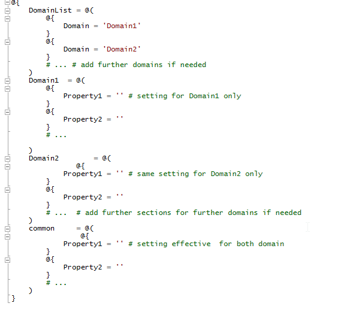

# Change log
### v1.0
Production ready release.
- added requested user's FirstName LastName into the subject of the email sent in the event of the template user was a leaver or not found in AD
- added DFS setup for all domain new starter
### v0.5
This version is to replace the old processes. The most notable difference for the users (users in this case are intended to be the Service Desk, managing the creation of new users / removal of leavers) is the output the script generates.

In the previous script, the output was a lot more detailed, providing details of the individual steps the script executed. In this one it just gives "at a glance" overview. For example: MBXProcessed (mailbox processed) replaces all the previous sub-steps (MBXGALHidden, MailboxFound, MBXShared,MBXLitigation, MBXOOM), as all of these should be needed (or the applicable ones at least) in order to report the processing succeded.

This makes the new report much condensed in width.
However, to help Service Desk to troubleshoot the issues, the summary email also received some upgrade.
(1) It is now one report / domain (per script run).
(2) There are now links to the generated reports, pointing to the internal server executing the script --> Service Desk members now can check almost live ("almost", as they ought to wait until the script run is finished, even though the first processed domain-s email sent out before that), what was the input/result/errors during the script run
(3) Finally, the report now contains the details of all the accounts processed in that script run for that domain, in one table.
# Onboarding

 1. Overview
 2. File structure
 3. Process details

## 1. Overview

The brief goal of the Onboarding is to provision a user account with only  a handful of information (first name, last name and employee ID and a template account to clone) provided in a format of a .csv. The script then creates and configures the AD object, creates the mailbox, configures DFS folders,  licenses the user and emails to Service Desk a summary of the work, and the main details and password to the designated line manager of the user.

## 2. File structure

 1. This is the configuration folder. In the current version it only holds the list of recipients - for easy editing, ie. if people unfamiliar with PowerShell data structure need to edit this, as .csv is fairly common.
 2. The creds fodler holds the credentials in an encrypted .xml format. To create these files, at the first occasion the script has to be ran interactively, using the account intended to be used for the scheduling. The user need to supply the username / password values. This will be stored and any further script run will uses these.
 3. These are the input folders for both off- and on-boarding. These should only contain .csv files waiting for processing
 4. This folder holds the log files generated during script runs and also the error logs
 5. These are imilar to the input folder, except that the script run outputs are saved here
 6. These are the actual script files.

- the two .ps1 files are the ones containing the process logics. They need to be attached to the scheduled tasks.
- the.psd1 file (not shared to Github) should contain the data specifig to the environment. Their structure is as follows:

 

- the .psm1 is the module containing all the work functions

## 3. Process

 1. The process usually started by a scheduled task
 2. The script, when triggered, first imports the necessary modules for the work. This includes loading some external modules, and the custom module found in the root folder.
 3. The various log files and output files are getting declared, also a transcript log is started for the script run.
 4. The next step (this and all further steps happen at each script run once per  each domain in the .psd1) is loading the config files. Both the domain-specific values and the common values are loaded for each domain.
 5. If there are lines matching the processed domain in the input files, the script then loads all the current users of the domain, and processes each lines in the imported .csv list.
 6. If the user defined template  in the input file line is a leaver, the execution ends prematurely and the script skips to the next line, until it processes each lines. (This is because in our current setup we remove all group memberships and organisational details from the leavers, therefore they are not usable for creating new accounts. The script notifies Service Desk on this outcome)
 7. If the user is not a leaver, the cycle starts:

- the template user's details will be stored, and where it is possible, they will be cloned for the new user
- the first name and last name provided in the .csv for the new starter will be used to generate the various names of the user (user principal name, sam account name, etc.); new password will also be generated; if given, expiration date and starting date (this later as an extensionAttribute, along with other company-specific extensionAttributes) values are being added to the account. Organizational unit location, group memberships - excluding licensing groups - are getting cloned from the template
- once the AD object is present, the script then checks, if the template's mailbox is o365 or on-prem (we use a hybrid environment currently); the new user's mailbox gets created accordingly, using Enable-RemoteMailbox or Enable-Mailbox respectively.
- The mailbox will receive .co.uk SMTP addresses by default, but since the group has .fr and .ie users too, if the primary SMTP of the template is non-.co.uk, the script changes thhis accordingly.
- The licensing is now fully group-based, so the new user will be added to either to the office f1 or e3 group, giving it appropriate licenses (assigning other licenses is something that is left to the Service Desk, they can add the AD account to further "LICENSING-" groups)
- As DFS is only used for one domain of the group, there a new DFS target is being defined for the starter

8. Finally, there are reports are being sent out: the manager of the new starter should receive the user's basic details, including the starter password, that the new starter is forced to change upon first login. The Service Desk should get a report too, for each processed *domain* (note, they are not receiving this for each use, but a summary of users for the domain). The Service Desk-email should hold links to the full processing and error-log, so that they can review the outputs of the script run and troubleshoot, if necessary.

# Offboarding

1. Overview
2. File structure
3. Process details

## 1. Overview

The Offboarding is very much similar to the Onboarding, in terms of that it also accepts a similar .csv file, and processes a leaver to the company standards.

## 2. File structure

The Offboarding uses the same file structure detailed above (the only differences are the on/off replacements in the file and folder name)

## 3. Process details
*(steps 1 - 5 are matching to the onboarding)*

 1. The process usually started by a scheduled task
 2. The script, when triggered, first imports the necessary modules for the work. This includes loading some external modules, and the custom module found in the root folder.
 3. The various log files and output files are getting declared, also a transcript log is started for the script run.
 4. The next step (this and all further steps happen at each script run once per  each domain in the .psd1) is loading the config files. Both the domain-specific values and the common values are loaded for each domain.
 5. If there are lines matching the processed domain in the input files, the script then loads all the current users of the domain, and processes each lines in the imported .csv list.
 6. First each line (user) will be checked for their current OU. If they are already in the designated leaver OU, the script skips the rest of the process, as in this case they are assumably already processed.
7. If this is not the case,
- the script first stores the manager and the current group memberships of the user. (For now only into variables)
- next it will process the AD account: disables the account, reset the password to a random complex password, to prevent any login attempt, removes all group membership (this includes license groups, therefore the users will be unlicensed), organizational details, etc.
- next is the processing of the mailbox of the user. the mailbox is moved to o365 if it is on-prem (we keep leaver mailboxes in on-prem only), it is converted to a shared mailbox; if it is possible, litigation hold is set to the account, out of office message is being added to the mailbox advising senders that the leaver is no longer with the company, and if it is requested, a forwarding is being set up
- licenses should be now only from licensing groups, but the script also does a check and removes non-group assigned licenses
- the manager and the group information is getting stored; if it is applicable, the user's DFS folder is copied to an archive folder; RDS profile disk of the user will be removed without retention; if applicable, user's VDI will also removed
- an email is to be sent to the designated HR person dealing with phones, to retrieve company mobiles
8. Finally, a summary is to be sent containing the processed users to Service Desk, which, similarly to the onboarding, contains links to the error files / transcript / brief summary.
